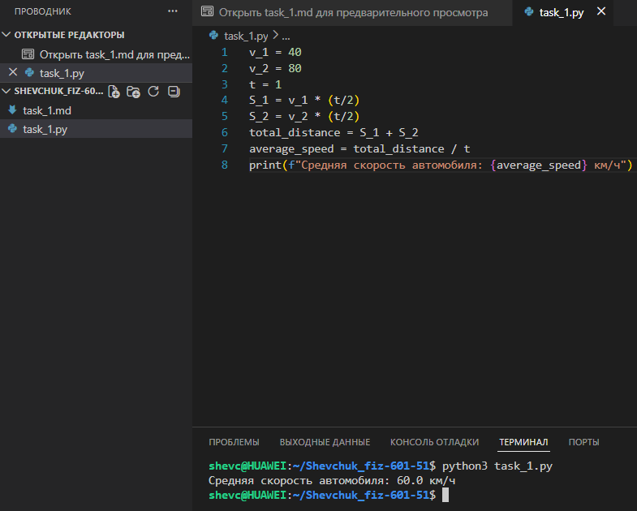

# **Отчёт**

## *Задание_1*

### *Рассчитайте среднюю скорость автомобиля, который первую половину часа ехал со скоростью 40 км/ч, а вторую половину часа — со скоростью 80 км/ч. Для решения:*
* *определите расстояние, пройденное за первую половину часа ($ S_1 $);*
* *определите расстояние, пройденное за вторую половину часа ($ S_2 $);*
* *найдите общее расстояние ($ total\_distance $);*
* *рассчитайте среднюю скорость ($ average\_speed $) как отношение общего расстояния ко всему времени движения;*
* *выведите результат на консоль в формате «Средняя скорость автомобиля: X км/ч».*
---
#### *Результаты вычислений*
```python
v_1 = 40
v_2 = 80
t = 1
S_1 = v_1 * (t/2)
S_2 = v_2 * (t/2)
total_distance = S_1 + S_2
average_speed = total_distance / t
print(f"Средняя скорость автомобиля: {average_speed} км/ч")
```


---
## *Список использованных источников:*

1. [The Python Tutorial — Basic Concepts and Expressions](https://docs.python.org/3/tutorial/introduction.html)  
2. [Python Documentation — Built‑in Types and Operations](https://docs.python.org/3/library/stdtypes.html)  
3. [Real Python — Python Basics: Variables and Data Types](https://realpython.com/python-variables/)  
4. [W3Schools Python — Basic Syntax and Variables](https://www.w3schools.com/python/python_variables.asp)  
5. [GeeksforGeeks — Python Arithmetic Operations](https://www.geeksforgeeks.org/python-arithmetic-operators/)  

---

**Пояснения к расчётам:**

* $v_1 = 40$ км/ч — скорость автомобиля в первой половине часа;
* $v_2 = 80$ км/ч — скорость автомобиля во второй половине часа;
* $t = 1$ ч — общее время движения;
* $S_1 = v_1 \cdot \frac{t}{2} = 40 \cdot \frac{1}{2} = 20$ км — расстояние, пройденное в первой половине пути;
* $S_2 = v_2 \cdot \frac{t}{2} = 80 \cdot \frac{1}{2} = 40$ км — расстояние, пройденное во второй половине пути;
* $total\_distance = S_1 + S_2 = 20 + 40 = 60$ км — общее пройденное расстояние;
* $average\_speed = \frac{total\_distance}{t} = \frac{60}{1} = 60$ км/ч — средняя скорость автомобиля за весь период движения.

**Результат выполнения кода:**
```python
Средняя скорость автомобиля: 60.0 км/ч
```
