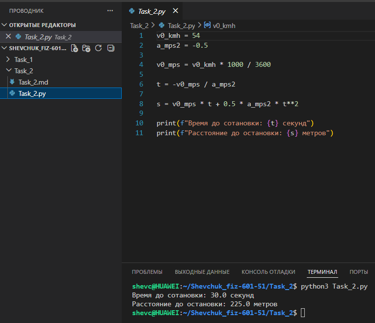

# **Отчёт**

## *Задание_2*

### *Рассчитайте время и расстояние до полной остановки автомобиля, который движется со скоростью 54 км/ч и начинает тормозить с ускорением −0.5 м/с². Для решения:*
* *переведите начальную скорость из км/ч в м/с;*
* *рассчитайте время до полной остановки, используя формулу $`t = -\frac{v_0}{a}`$;*
* *определите пройденное расстояние до остановки по формуле равноускоренного движения $`s = v_0 t + \frac{1}{2} a t^2`$;*
* *выведите результаты на консоль в формате: «Время до остановки: X секунд» и «Расстояние до остановки: Y метров».*
---
#### *Результаты вычислений*
```python
v0_kmh = 54
a_mps2 = -0.5

v0_mps = v0_kmh * 1000 / 3600

t = -v0_mps / a_mps2

s = v0_mps * t + 0.5 * a_mps2 * t**2
print(f"Время до остановки: {t} секунд")
print(f"Расстояние до остановки: {s} метров")
```


---
## *Список использованных источников:*

1. [The Python Tutorial — Basic Concepts and Expressions](https://docs.python.org/3/tutorial/introduction.html)  
6. [Физика. Кинематика равноускоренного движения](https://physics.ru/courses/op25part1/content/chapter1/section/paragraph3/theory.html)

---

**Пояснения к расчётам:**

* $v_{0\_kmh} = 54$ км/ч — начальная скорость автомобиля;
* $a_{mps2} = -0{,}5$ м/с² — ускорение (замедление) при торможении;
* перевод скорости в м/с: $v_{0\_mps} = v_{0\_kmh} \cdot \frac{1000}{3600} = 54 \cdot \frac{1000}{3600} = 15$ м/с;
* время до остановки: $t = -\frac{v_{0\_mps}}{a_{mps2}} = -\frac{15}{-0{,}5} = 30$ секунд;
* расстояние до остановки:
  $s = v_{0\_mps} \cdot t + \frac{1}{2} \cdot a_{mps2} \cdot t^2 = 15 \cdot 30 + \frac{1}{2} \cdot (-0{,}5) \cdot 30^2 =$
  $= 450 + \frac{1}{2} \cdot (-0{,}5) \cdot 900 = 450 - 225 = 225$ метров.

**Результат выполнения кода:**
```
Время до остановки: 30.0 секунд
Расстояние до остановки: 225.0 метров
```

**Примечания:**
* Отрицательное значение ускорения указывает на процесс торможения (замедления).
* Формула расчёта расстояния учитывает как начальную скорость, так и отрицательное ускорение.
* Все единицы измерения приведены к единой системе (СИ): м/с, м/с², секунды, метры.
