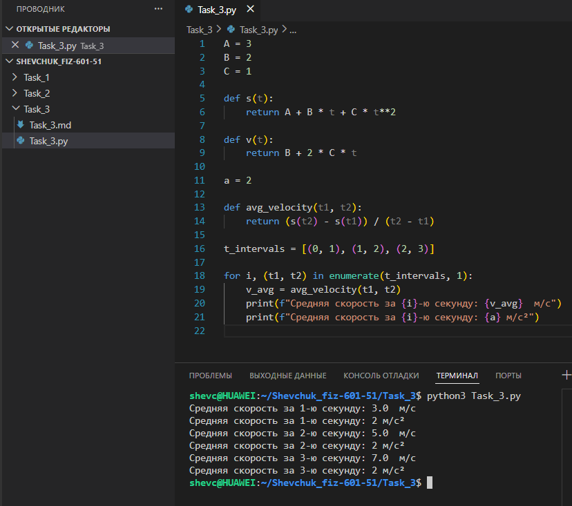

# **Отчёт**

## *Задание_3*

### *Рассчитайте среднюю скорость движения объекта на последовательных односекундных интервалах времени (0–1 с, 1–2 с, 2–3 с), если закон его движения задаётся функцией $`s(t) = A + Bt + Ct^2`$, где $`A = 3`$, $`B = 2`$, $`C = 1`$.*
---
#### *Реализация*
```python
A = 3
B = 2
C = 1

def s(t):
    return A + B * t + C * t**2

def v(t):
    return B + 2 * C * t

a = 2

def avg_velocity(t1, t2):
    return (s(t2) - s(t1)) / (t2 - t1)

t_intervals = [(0, 1), (1, 2), (2, 3)]

for i, (t1, t2) in enumerate(t_intervals, 1):
    v_avg = avg_velocity(t1, t2)
    print(f"Средняя скорость за {i}-ю секунду: {v_avg}  м/с")
    print(f"Средняя скорость за {i}-ю секунду: {a} м/с²")
```


---
## *Список использованных источников:*

1. [The Python Tutorial — Defining Functions](https://docs.python.org/3/tutorial/controlflow.html#defining-functions)    
2. [Физика. Кинематика: путь, скорость, ускорение](https://physics.ru/courses/op25part1/content/chapter1/section/paragraph3/theory.html)

---

**Пояснения к расчётам:**

* Параметры движения:
  * $A = 3$ — начальное положение (м);
  * $B = 2$ — начальная скорость (м/с);
  * $C = 1$ — половина ускорения (м/с²), откуда ускорение $a = 2C = 2$ м/с².
* Функция пути: $s(t) = 3 + 2t + t^2$.
* Функция скорости: $v(t) = 2 + 2t$ (производная от $s(t)$).
* Средняя скорость на интервале $[t_1, t_2]$: $v_{avg} = \frac{s(t_2) - s(t_1)}{t_2 - t_1}$.

**Расчёты по интервалам:**

1. Интервал $[0, 1]$:
   * $s(0) = 3$, $s(1) = 3 + 2 \cdot 1 + 1^2 = 6$;
   * $v_{avg} = \frac{6 - 3}{1 - 0} = 3$ м/с.
2. Интервал $[1, 2]$:
   * $s(1) = 6$, $s(2) = 3 + 2 \cdot 2 + 2^2 = 11$;
   * $v_{avg} = \frac{11 - 6}{2 - 1} = 5$ м/с.
3. Интервал $[2, 3]$:
   * $s(2) = 11$, $s(3) = 3 + 2 \cdot 3 + 3^2 = 18$;
   * $v_{avg} = \frac{18 - 11}{3 - 2} = 7$ м/с.

**Результат выполнения кода:**
```
Средняя скорость за 1-ю секунду: 3.0  м/с
Средняя скорость за 1-ю секунду: 2 м/с²
Средняя скорость за 2-ю секунду: 5.0  м/с
Средняя скорость за 2-ю секунду: 2 м/с²
Средняя скорость за 3-ю секунду: 7.0  м/с
Средняя скорость за 3-ю секунду: 2 м/с²
```
