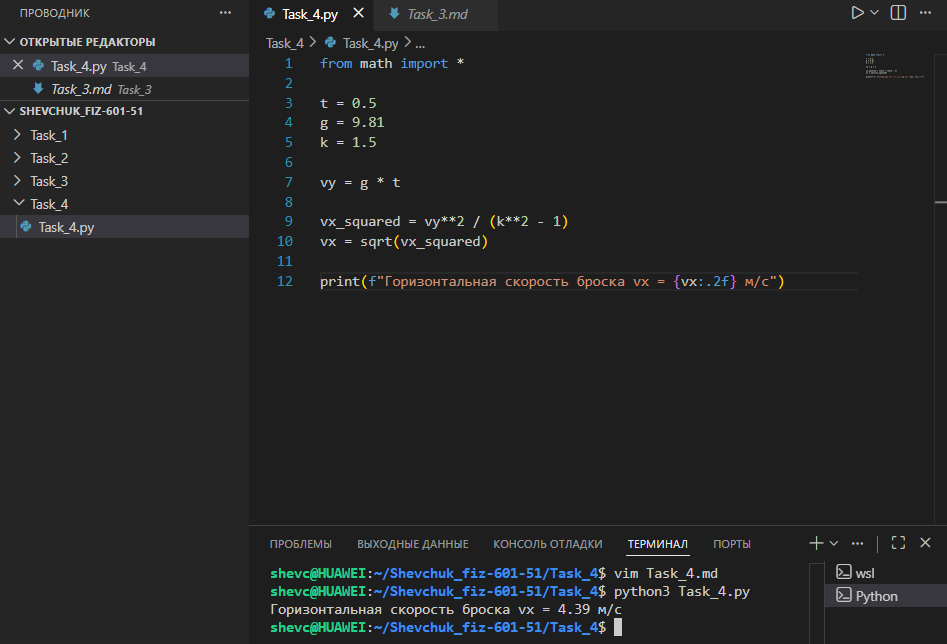

# **Отчёт**

## *Задание_4*

### *Рассчитайте горизонтальную скорость броска тела, если известно, что через $`t = 0{,}5`$ с вертикальная составляющая скорости достигла значения $`v_y = g \cdot t`$, а отношение вертикальной и горизонтальной скоростей определяется параметром $`k = 1{,}5`$. Для решения:*
* *вычислите вертикальную скорость $`v_y`$ через заданное время $`t`$ по формуле свободного падения;*
* *используя соотношение $`k = \frac{v_y}{v_x}`$, выразите $`v_x^2 = \frac{v_y^2}{k^2 - 1}`$ и найдите $`v_x`$;*
* *выведите результат на консоль с округлением до двух знаков после запятой в формате «Горизонтальная скорость броска vx = X м/с».*
---
#### *Результаты вычислений*
```python
from math import sqrt

t = 0.5
g = 9.81
k = 1.5

vy = g * t

vx_squared = vy**2 / (k**2 - 1)
vx = sqrt(vx_squared)

print(f"Горизонтальная скорость броска vx = {vx:.2f} м/с")
```
---

---
## *Список использованных источников:*

1. [The Python Tutorial — Math Module](https://docs.python.org/3/library/math.html)  
2. [Physics Classroom — Projectile Motion](https://www.physicsclassroom.com/class/vectors/Lesson-2/Projectile-Motion)  
3. [HyperPhysics — Motion in Two Dimensions](http://hyperphysics.phy-astr.gsu.edu/hbase/mot.html)  
4. [Real Python — Working with Numbers in Python](https://realpython.com/python-numbers/)  
5. [W3Schools Python — Math Functions](https://www.w3schools.com/python/module_math.asp)  

---

**Пояснения к расчётам:**

* Исходные данные:
  * $t = 0{,}5$ с — время падения;
  * $g = 9{,}81$ м/с² — ускорение свободного падения;
  * $k = 1{,}5$ — коэффициент отношения вертикальной и горизонтальной скоростей.
* Вертикальная скорость через время $t$:
  $v_y = g \cdot t = 9{,}81 \cdot 0{,}5 = 4{,}905$ м/с.
* Соотношение скоростей задаётся условием $k = \frac{v_y}{v_x}$. Отсюда:
  $v_x^2 = \frac{v_y^2}{k^2 - 1}$.
* Подставляем значения:
  $v_x^2 = \frac{(4{,}905)^2}{(1{,}5)^2 - 1} = \frac{24{,}059}{2{,}25 - 1} = \frac{24{,}059}{1{,}25} \approx 19{,}247$.
* Находим горизонтальную скорость:
  $v_x = \sqrt{19{,}247} \approx 4{,}39$ м/с.

**Результат выполнения кода:**
```
Горизонтальная скорость броска vx = 4.39 м/с
```

**Примечания:**
* В коде используется модуль `math` для функции `sqrt()` — извлечения квадратного корня.
* Формула $v_x^2 = \frac{v_y^2}{k^2 - 1}$ следует из условия задачи и геометрических соотношений между компонентами скорости.
* Округление результата до двух знаков после запятой выполнено с помощью форматирования строки `{vx:.2f}`.
