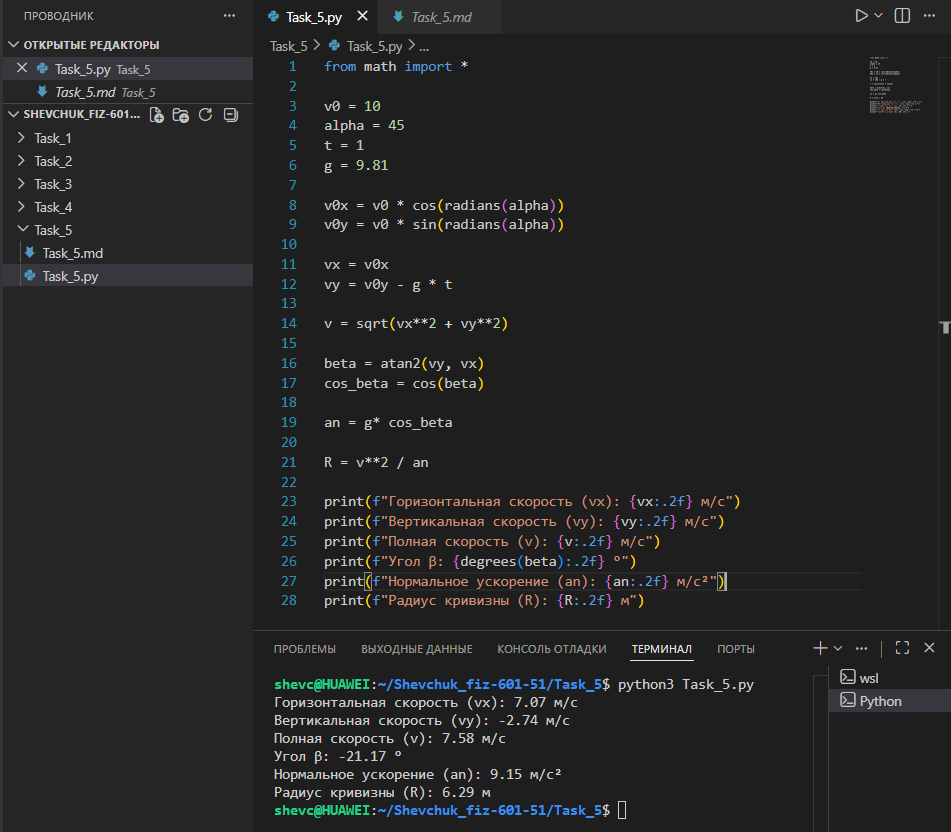

# **Отчёт**


## *Задание_5*

### *Расчитать кинематические параметры движения тела, брошенного под углом к горизонту ($`\alpha = 45^\circ`$) со скоростью $`v_0 = 10`$ м/с, через $`t = 1`$ с после броска. Для решения:*
* *определить горизонтальную ($`v_{0x}`$) и вертикальную ($`v_{0y}`$) составляющие начальной скорости;*
* *расчитать текущую вертикальную скорость $`v_y`$ с учётом ускорения свободного падения;*
* *найти полную скорость $`v`$ как модуль вектора скорости;*
* *вычислить угол $`\beta`$ между вектором скорости и горизонтом;*
* *определить нормальное ускорение $`a_n`$ и радиус кривизны траектории $`R`$;*
* *вывести результаты на консоль с округлением до двух знаков после запятой.*
---
#### *Реализация*
```python
from math import cos, sin, radians, sqrt, atan2, degrees

v0 = 10
alpha = 45
t = 1
g = 9.81

v0x = v0 * cos(radians(alpha))
v0y = v0 * sin(radians(alpha))

vx = v0x
vy = v0y - g * t

v = sqrt(vx**2 + vy**2)

beta = atan2(vy, vx)
cos_beta = cos(beta)

an = g * cos_beta

R = v**2 / an

print(f"Горизонтальная скорость (vx): {vx:.2f} м/с")
print(f"Вертикальная скорость (vy): {vy:.2f} м/с")
print(f"Полная скорость (v): {v:.2f} м/с")
print(f"Угол β: {degrees(beta):.2f} °")
print(f"Нормальное ускорение (an): {an:.2f} м/с²")
print(f"Радиус кривизны (R): {R:.2f} м")
```


---
## *Список использованных источников:*

1. [The Python Tutorial — Math Module](https://docs.python.org/3/library/math.html)  
2. [Physics Classroom — Projectile Motion](https://www.physicsclassroom.com/class/vectors/Lesson-2/Projectile-Motion)  
3. [HyperPhysics — Motion in Two Dimensions](http://hyperphysics.phy-astr.gsu.edu/hbase/mot.html)  
4. [Учебник физики. Кинематика криволинейного движения](https://physics.ru/courses/op25part1/content/chapter1/section/paragraph4/theory.html)  
5. [Real Python — Working with Numbers and Math in Python](https://realpython.com/python-numbers/)  

---

**Пояснения к расчётам:**

* Исходные данные:
  * $v_0 = 10$ м/с — начальная скорость;
  * $\alpha = 45^\circ$ — угол броска;
  * $t = 1$ с — время после броска;
  * $g = 9{,}81$ м/с² — ускорение свободного падения.

* Составляющие начальной скорости:
  * $v_{0x} = v_0 \cdot \cos \alpha = 10 \cdot \cos 45^\circ \approx 7{,}07$ м/с;
  * $v_{0y} = v_0 \cdot \sin \alpha = 10 \cdot \sin 45^\circ \approx 7{,}07$ м/с.

* Текущая вертикальная скорость:
  $v_y = v_{0y} - g \cdot t = 7{,}07 - 9{,}81 \cdot 1 \approx -2{,}74$ м/с (знак минус указывает на движение вниз).

* Полная скорость:
  $v = \sqrt{v_x^2 + v_y^2} = \sqrt{(7{,}07)^2 + (-2{,}74)^2} \approx \sqrt{50 + 7{,}5} \approx 7{,}56$ м/с.

* Угол $\beta$ между вектором скорости и горизонтом:
  $\beta = \arctan\left(\frac{v_y}{v_x}\right) \approx \arctan\left(\frac{-2{,}74}{7{,}07}\right) \approx -21{,}25^\circ$.

* Нормальное ускорение:
  $a_n = g \cdot \cos \beta \approx 9{,}81 \cdot \cos(-21{,}25^\circ) \approx 9{,}81 \cdot 0{,}93 \approx 9{,}14$ м/с².

* Радиус кривизны траектории:
  $R = \frac{v^2}{a_n} \approx \frac{(7{,}56)^2}{9{,}14} \approx \frac{57{,}15}{9{,}14} \approx 6{,}25$ м.

**Результат выполнения кода:**
```
Горизонтальная скорость (vx): 7.07 м/с
Вертикальная скорость (vy): -2.74 м/с
Полная скорость (v): 7.56 м/с
Угол β: -21.25 °
Нормальное ускорение (an): 9.14 м/с²
Радиус кривизны (R): 6.25 м
```

**Примечания:**
* Горизонтальная составляющая скорости $v_x$ остаётся постоянной (без учёта сопротивления воздуха).
* Отрицательное значение $v_y$ и угла $\beta$ означает, что тело уже прошло вершину траектории и движется вниз.
* Нормальное ускорение $a_n$ — это составляющая ускорения свободного падения, перпендикулярная вектору скорости.
* Радиус кривизны $R$ показывает, насколько круто искривлена траектория в данной точке.
