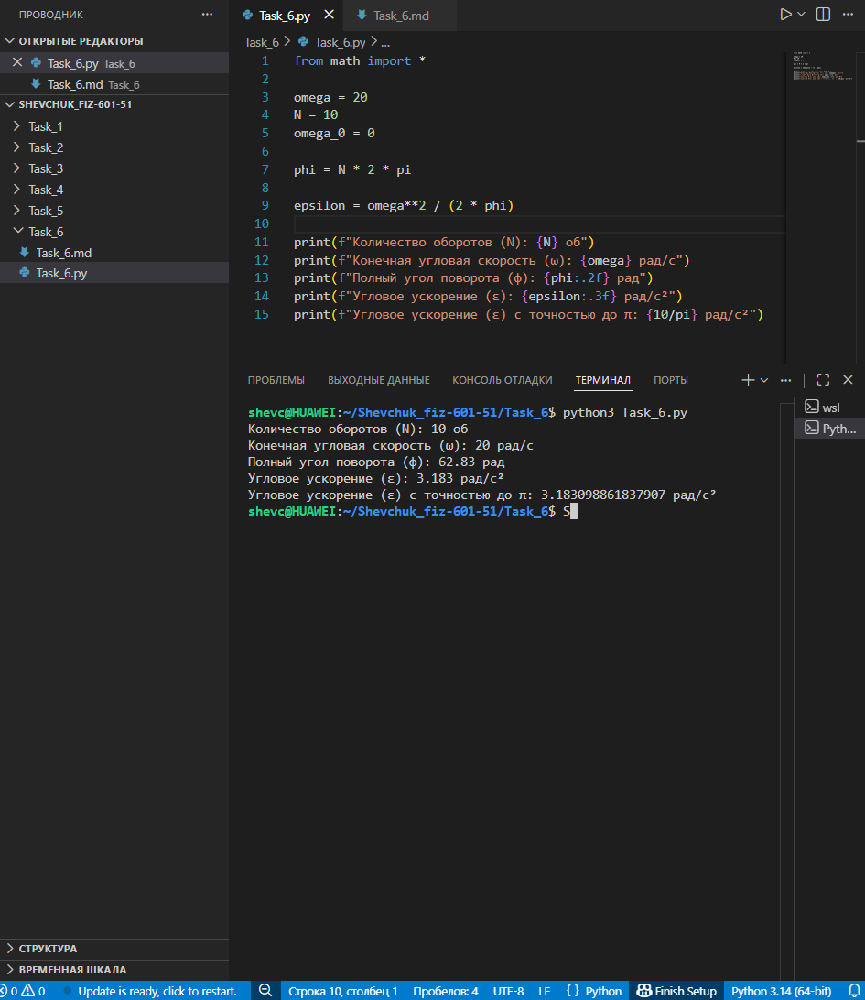

# **Отчёт**


## *Задание_6*


### *Рассчитайте параметры вращательного движения тела, которое совершило $`N = 10`$ оборотов, достигнув конечной угловой скорости $`\omega = 20`$ рад/с из состояния покоя ($`\omega_0 = 0`$). Для решения:*
* *определить полный угол поворота $`\varphi`$ в радианах, соответствующий заданному числу оборотов;*
* *используя кинематическое уравнение для равноускоренного вращательного движения, найти угловое ускорение $`\varepsilon`$ по формуле $`\varepsilon = \frac{\omega^2}{2\varphi}`$;*
* *вывести на консоль количество оборотов, конечную угловую скорость, полный угол поворота (с округлением до двух знаков после запятой), угловое ускорение (с округлением до трёх знаков после запятой) и угловое ускорение с точностью до $`\pi`$.*
---
#### *Реализация*
```python
from math import pi

omega = 20
N = 10
omega_0 = 0

phi = N * 2 * pi

epsilon = omega**2 / (2 * phi)

print(f"Количество оборотов (N): {N} об")
print(f"Конечная угловая скорость (ω): {omega} рад/с")
print(f"Полный угол поворота (φ): {phi:.2f} рад")
print(f"Угловое ускорение (ε): {epsilon:.3f} рад/с²")
print(f"Угловое ускорение (ε) с точностью до π: {10/pi:.3f} рад/с²")
```


---
## *Список использованных источников:*

1. [The Python Tutorial — Math Module](https://docs.python.org/3/library/math.html)  
2. [HyperPhysics — Rotational Motion](http://hyperphysics.phy-astr.gsu.edu/hbase/rotq.html)  
3. [Physics Classroom — Rotational Kinematics](https://www.physicsclassroom.com/class/circles/Lesson-2/Rotational-Kinematics)  
4. [Учебник физики. Кинематика вращательного движения](https://physics.ru/courses/op25part1/content/chapter1/section/paragraph5/theory.html)  
5. [Real Python — Working with Numbers and Math in Python](https://realpython.com/python-numbers/)  

---

**Пояснения к расчётам:**

* Исходные данные:
  * $N = 10$ — количество оборотов;
  * $\omega = 20$ рад/с — конечная угловая скорость;
  * $\omega_0 = 0$ рад/с — начальная угловая скорость (движение начинается из состояния покоя).

* Полный угол поворота $\varphi$ связан с количеством оборотов соотношением:
  $\varphi = N \cdot 2\pi = 10 \cdot 2\pi \approx 62{,}83$ рад.

* Угловое ускорение $\varepsilon$ при равноускоренном вращении (из состояния покоя) определяется по формуле:
  $\varepsilon = \frac{\omega^2}{2\varphi} = \frac{20^2}{2 \cdot 62{,}83} = \frac{400}{125{,}66} \approx 3{,}183$ рад/с².

* Значение $\frac{10}{\pi}$ (приближённое представление углового ускорения через $\pi$):
  $\frac{10}{\pi} \approx \frac{10}{3{,}1416} \approx 3{,}183$ рад/с².

**Результат выполнения кода:**
```
Количество оборотов (N): 10 об
Конечная угловая скорость (ω): 20 рад/с
Полный угол поворота (φ): 62.83 рад
Угловое ускорение (ε): 3.183 рад/с²
Угловое ускорение (ε) с точностью до π: 3.183 рад/с²
```

**Примечания:**
* Формула $\varphi = 2\pi N$ связывает количество оборотов с углом поворота в радианах (один полный оборот соответствует углу $2\pi$ рад).
* Формула для углового ускорения $\varepsilon = \frac{\omega^2}{2\varphi}$ выводится из основного кинематического уравнения вращательного движения: $\omega^2 = \omega_0^2 + 2\varepsilon\varphi$, где $\omega_0 = 0$.
* Округление результатов до указанного количества знаков после запятой выполнено с помощью форматирования строк (`{phi:.2f}`, `{epsilon:.3f}`).
* Значение `10/pi` в коде служит альтернативным представлением углового ускорения, выраженным через $\pi$, что может быть полезно для аналитических оценок.