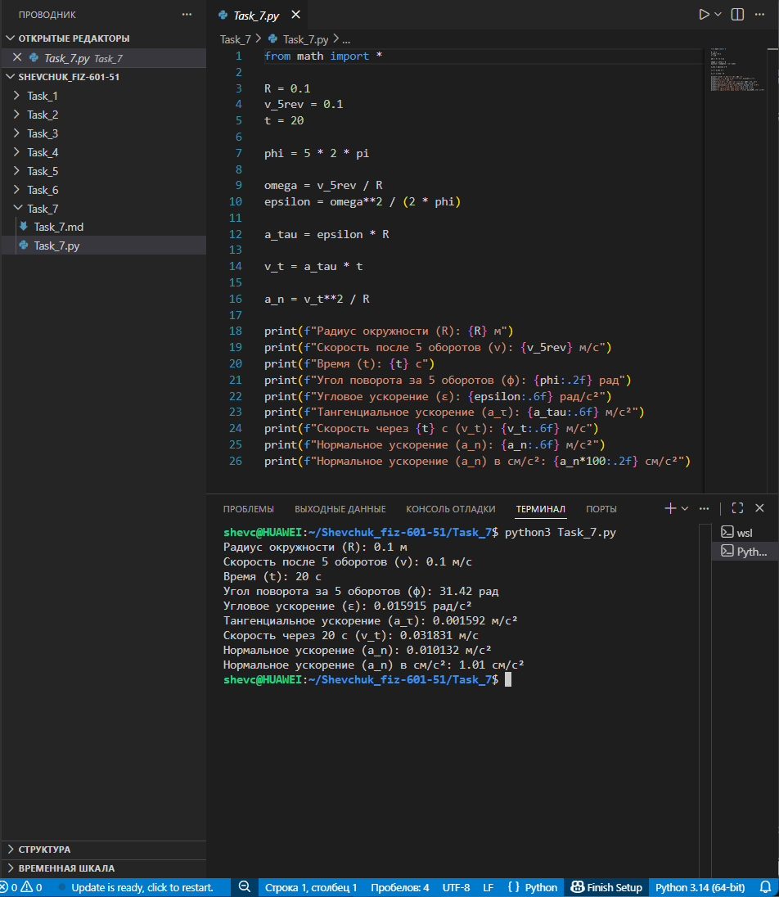

# **Отчёт**

## *Задание_7*


### *Рассчитайте кинематические параметры вращательного движения точки по окружности радиуса $R = 0{,}1$ м, если после 5 оборотов её скорость составила $v_{5\text{rev}} = 0{,}1$ м/с. Движение начинается из состояния покоя и длится $t = 20$ с. Для решения:*
* *определить полный угол поворота $\varphi$ за 5 оборотов;*
* *найти угловую скорость $\omega$ через линейную скорость и радиус;*
* *рассчитать угловое ускорение $\varepsilon$ по формуле $\varepsilon = \frac{\omega^2}{2\varphi}$;*
* *вычислить тангенциальное ускорение $a_\tau = \varepsilon \cdot R$;*
* *найти скорость через $t = 20$ с: $v_t = a_\tau \cdot t$;*
* *определить нормальное ускорение $a_n = \frac{v_t^2}{R}$;*
* *вывести все параметры на консоль с требуемой точностью.*
---
#### *Реализация*
```python
from math import pi

R = 0.1
v_5rev = 0.1
t = 20

phi = 5 * 2 * pi

omega = v_5rev / R
epsilon = omega**2 / (2 * phi)

a_tau = epsilon * R

v_t = a_tau * t

a_n = v_t**2 / R

print(f"Радиус окружности (R): {R} м")
print(f"Скорость после 5 оборотов (v): {v_5rev} м/с")
print(f"Время (t): {t} с")
print(f"Угол поворота за 5 оборотов (φ): {phi:.2f} рад")
print(f"Угловое ускорение (ε): {epsilon:.6f} рад/с²")
print(f"Тангенциальное ускорение (a_τ): {a_tau:.6f} м/с²")
print(f"Скорость через {t} с (v_t): {v_t:.6f} м/с")
print(f"Нормальное ускорение (a_n): {a_n:.6f} м/с²")
print(f"Нормальное ускорение (a_n) в см/с²: {a_n*100:.2f} см/с²")
```


---
## *Список использованных источников:*

1. [The Python Tutorial — Math Module](https://docs.python.org/3/library/math.html)  
2. [HyperPhysics — Rotational Motion](http://hyperphysics.phy-astr.gsu.edu/hbase/rotq.html)  
3. [Physics Classroom — Rotational Kinematics](https://www.physicsclassroom.com/class/circles/Lesson-2/Rotational-Kinematics)  
4. [Учебник физики. Кинематика вращательного движения](https://physics.ru/courses/op25part1/content/chapter1/section/paragraph5/theory.html)  
5. [Real Python — Working with Numbers and Math in Python](https://realpython.com/python-numbers/)  

---

**Пояснения к расчётам:**

* Исходные данные:
  * $R = 0{,}1$ м — радиус окружности;
  * $v_{5\text{rev}} = 0{,}1$ м/с — линейная скорость после 5 оборотов;
  * $t = 20$ с — время движения.

* Полный угол поворота за 5 оборотов:
  $\varphi = 5 \cdot 2\pi = 10\pi \approx 31{,}42$ рад.

* Угловая скорость:
  $\omega = \frac{v_{5\text{rev}}}{R} = \frac{0{,}1}{0{,}1} = 1$ рад/с.

* Угловое ускорение:
  $\varepsilon = \frac{\omega^2}{2\varphi} = \frac{1^2}{2 \cdot 31{,}42} \approx \frac{1}{62{,}84} \approx 0{,}015915$ рад/с².

* Тангенциальное ускорение:
  $a_\tau = \varepsilon \cdot R = 0{,}015915 \cdot 0{,}1 \approx 0{,}001592$ м/с².

* Скорость через $t = 20$ с:
  $v_t = a_\tau \cdot t = 0{,}001592 \cdot 20 \approx 0{,}031831$ м/с.

* Нормальное ускорение:
  $a_n = \frac{v_t^2}{R} = \frac{(0{,}031831)^2}{0{,}1} \approx \frac{0{,}001013}{0{,}1} \approx 0{,}010132$ м/с².
  В см/с²: $a_n \cdot 100 \approx 1{,}01$ см/с².

**Результат выполнения кода:**
```
Радиус окружности (R): 0.1 м
Скорость после 5 оборотов (v): 0.1 м/с
Время (t): 20 с
Угол поворота за 5 оборотов (φ): 31.42 рад
Угловое ускорение (ε): 0.015915 рад/с²
Тангенциальное ускорение (a_τ): 0.001592 м/с²
Скорость через 20 с (v_t): 0.031831 м/с
Нормальное ускорение (a_n): 0.010132 м/с²
Нормальное ускорение (a_n) в см/с²: 1.01 см/с²
```

**Примечания:**
* Формула $\varphi = 2\pi N$ связывает количество оборотов $N$ с углом поворота в радианах.
* Связь линейной и угловой скорости: $v = \omega R$.
* Формула углового ускорения $\varepsilon = \frac{\omega^2}{2\varphi}$ выводится из уравнения равноускоренного вращательного движения: $\omega^2 = \omega_0^2 + 2\varepsilon\varphi$, где $\omega_0 = 0$.
* Тангенциальное ускорение связано с угловым соотношением $a_\tau = \varepsilon R$.
* Нормальное (центростремительное) ускорение определяется скоростью движения по окружности и радиусом: $a_n = \frac{v^2}{R}$.
* Округление результатов выполнено с помощью форматирования строк (`{phi:.2f}`, `{epsilon:.6f}` и т. д.).