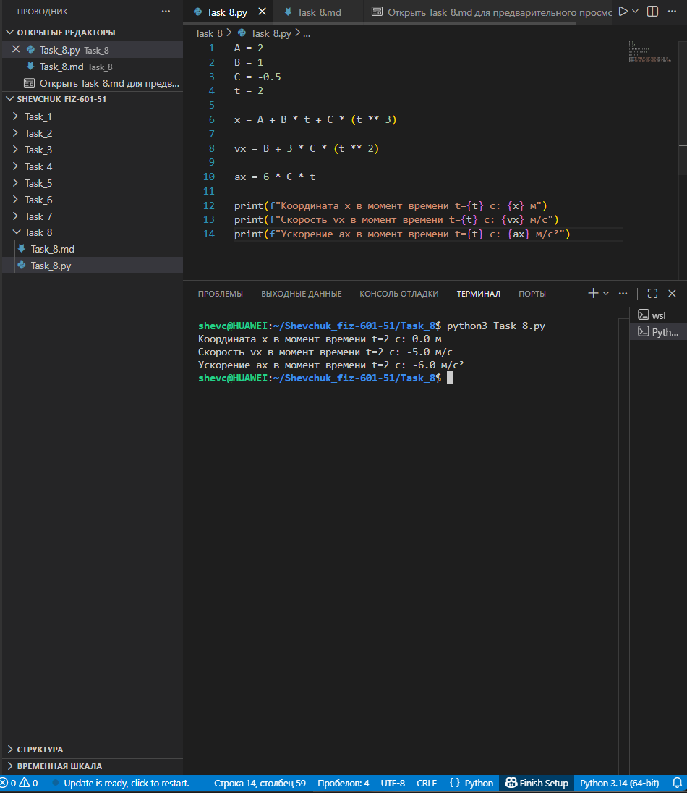

# **Отчёт**

## *Задание_8*

### *Рассчитайте координату, скорость и ускорение объекта в момент времени $`t = 2`$ с, если закон его движения задаётся функцией $`x(t) = A + Bt + Ct^3`$, где $`A = 2`$, $`B = 1`$, $`C = -0{,}5`$. Для решения:*
* *определить координату $`x`$ в заданный момент времени;*
* *найти скорость $`v_x`$ как первую производную от функции координаты по времени;*
* *вычислить ускорение $`a_x`$ как вторую производную от функции координаты (или первую производную от скорости) по времени;*
* *вывести результаты на консоль.*
---
#### *Реализация*
```python
A = 2
B = 1
C = -0.5
t = 2

x = A + B * t + C * (t ** 3)

vx = B + 3 * C * (t ** 2)

ax = 6 * C * t

print(f"Координата x в момент времени t={t} с: {x} м")
print(f"Скорость vx в момент времени t={t} с: {vx} м/с")
print(f"Ускорение ax в момент времени t={t} с: {ax} м/с²")
```


---
## *Список использованных источников:*

1. [The Python Tutorial — Basic Syntax and Data Structures](https://docs.python.org/3/tutorial/index.html)  
2. [Физика. Кинематика: путь, скорость, ускорение](https://physics.ru/courses/op25part1/content/chapter1/section/paragraph3/theory.html)  
3. [HyperPhysics — Kinematics](http://hyperphysics.phy-astr.gsu.edu/hbase/mot.html)  
4. [Real Python — Working with Numbers and Math in Python](https://realpython.com/python-numbers/)  

---

**Пояснения к расчётам:**

* Параметры движения:
  * $A = 2$ — начальное положение (м);
  * $B = 1$ — коэффициент, влияющий на линейную составляющую движения (м/с);
  * $C = -0{,}5$ — коэффициент при кубическом члене (м/с³), определяющий нелинейное изменение положения.
* Функция координаты: $x(t) = 2 + t - 0{,}5t^3$.
* Скорость — первая производная координаты по времени:
  $v_x(t) = \frac{dx}{dt} = 1 - 1{,}5t^2$.
* Ускорение — вторая производная координаты (первая производная скорости) по времени:
  $a_x(t) = \frac{d^2x}{dt^2} = \frac{dv_x}{dt} = -3t$.

**Расчёты для момента времени $t = 2$ с:**

1. Координата $x$:
   * $x(2) = 2 + 1 \cdot 2 - 0{,}5 \cdot 2^3 = 2 + 2 - 0{,}5 \cdot 8 = 4 - 4 = 0$ м.

2. Скорость $v_x$:
   * $v_x(2) = 1 - 1{,}5 \cdot 2^2 = 1 - 1{,}5 \cdot 4 = 1 - 6 = -5$ м/с.
   * Отрицательное значение скорости означает, что объект движется в направлении, противоположном положительному направлению оси $x$.

3. Ускорение $a_x$:
   * $a_x(2) = -3 \cdot 2 = -6$ м/с².
   * Отрицательное ускорение указывает на замедление движения в положительном направлении или ускорение в отрицательном направлении.

**Результат выполнения кода:**
```
Координата x в момент времени t=2 с: 0 м
Скорость vx в момент времени t=2 с: -5 м/с
Ускорение ax в момент времени t=2 с: -6 м/с²
```

**Примечания:**
* Кубическая зависимость координаты от времени ($t^3$) приводит к нелинейному изменению скорости и ускорения.
* Отрицательный коэффициент $C$ обуславливает уменьшение скорости со временем и отрицательное ускорение.
* В момент $t = 2$ с объект проходит начало координат ($x = 0$) и движется в отрицательном направлении оси $x$ с ускорением, также направленным в отрицательную сторону.