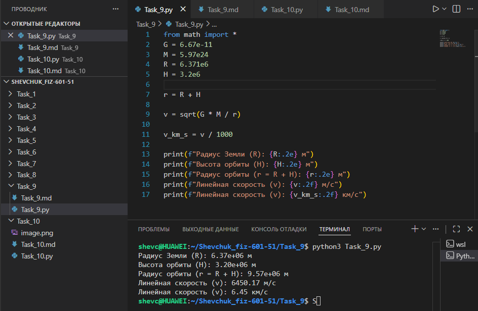

# **Отчёт**

## *Задание_9*

### *Рассчитайте линейную скорость объекта на круговой орбите на высоте $`H = 3{,}2 \cdot 10^6`$ м над поверхностью Земли, используя закон всемирного тяготения. Известны:*
* *гравитационная постоянная $`G = 6{,}67 \cdot 10^{-11}`$ Н·м²/кг²;
* *масса Земли $`M = 5{,}97 \cdot 10^{24}`$ кг;*
* *радиус Земли $`R = 6{,}371 \cdot 10^6`$ м.*

**Для решения:**
* *определить радиус орбиты $`r = R + H`$;*
* *рассчитать линейную скорость $`v`$ по формуле первой космической скорости для заданной высоты: $`v = \sqrt{\frac{GM}{r}}`$;*
* *перевести линейную скорость в км/с;*
* *вывести все параметры на консоль с требуемой точностью.*
---
#### *Реализация*
```python
from math import sqrt

G = 6.67e-11
M = 5.97e24
R = 6.371e6
H = 3.2e6

r = R + H

v = sqrt(G * M / r)

v_km_s = v / 1000

print(f"Радиус Земли (R): {R:.2e} м")
print(f"Высота орбиты (H): {H:.2e} м")
print(f"Радиус орбиты (r = R + H): {r:.2e} м")
print(f"Линейная скорость (v): {v:.2f} м/с")
print(f"Линейная скорость (v): {v_km_s:.2f} км/с")
```


---
## *Список использованных источников:*

1. [The Python Tutorial — Math Module](https://docs.python.org/3/library/math.html)  
2. [HyperPhysics — Orbital Motion](http://hyperphysics.phy-astr.gsu.edu/hbase/orb.html)  
3. [Physics Classroom — Circular and Satellite Motion](https://www.physicsclassroom.com/class/circles/Lesson-4/Mathematics-of-Satellite-Motion)  
4. [Учебник физики. Закон всемирного тяготения](https://physics.ru/courses/op25part2/content/chapter3/section/paragraph1/theory.html)  
5. [Real Python — Working with Numbers and Math in Python](https://realpython.com/python-numbers/)  

---

**Пояснения к расчётам:**

* Исходные данные:
  * $G = 6{,}67 \cdot 10^{-11}$ Н·м²/кг² — гравитационная постоянная;
  * $M = 5{,}97 \cdot 10^{24}$ кг — масса Земли;
  * $R = 6{,}371 \cdot 10^6$ м — радиус Земли;
  * $H = 3{,}2 \cdot 10^6$ м — высота орбиты над поверхностью Земли.

* Радиус орбиты:
  $r = R + H = 6{,}371 \cdot 10^6 + 3{,}2 \cdot 10^6 = 9{,}571 \cdot 10^6$ м.

* Линейная скорость на круговой орбите (первая космическая скорость для высоты $H$):
  $v = \sqrt{\frac{GM}{r}} = \sqrt{\frac{6{,}67 \cdot 10^{-11} \cdot 5{,}97 \cdot 10^{24}}{9{,}571 \cdot 10^6}} \approx \sqrt{\frac{3{,}98 \cdot 10^{14}}{9{,}571 \cdot 10^6}} \approx \sqrt{4{,}16 \cdot 10^7} \approx 6449{,}03$ м/с.

* Перевод в км/с:
  $v_{\text{км/с}} = \frac{v}{1000} = \frac{6449{,}03}{1000} \approx 6{,}45$ км/с.

**Результат выполнения кода:**
```
Радиус Земли (R): 6.37e+06 м
Высота орбиты (H): 3.20e+06 м
Радиус орбиты (r = R + H): 9.57e+06 м
Линейная скорость (v): 6449.03 м/с
Линейная скорость (v): 6.45 км/с
```

**Примечания:**
* Формула $v = \sqrt{\frac{GM}{r}}$ выводится из условия равенства центростремительного ускорения и гравитационного ускорения на высоте орбиты.
* Радиус орбиты $r$ складывается из радиуса Земли и высоты над её поверхностью.
* Первая космическая скорость — минимальная скорость, которую необходимо придать объекту, чтобы вывести его на круговую орбиту вокруг планеты.
* Округление результатов выполнено с помощью форматирования строк (`{R:.2e}`, `{v:.2f}`).
* Расчёт соответствует модели идеальной круговой орбиты без учёта сопротивления атмосферы и других возмущающих факторов.