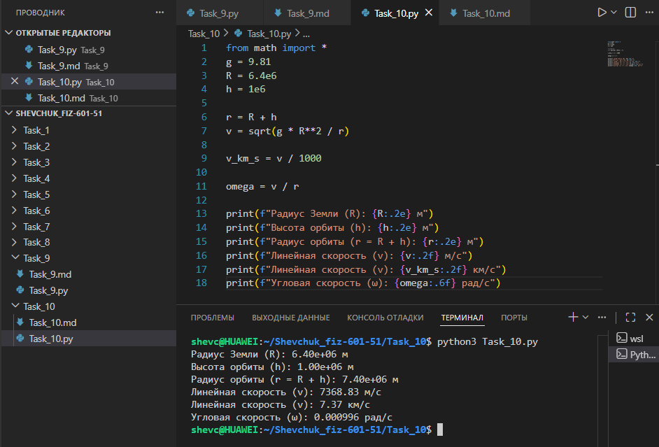

# **Отчёт**

## *Задание_10*

### *Рассчитайте линейную и угловую скорости объекта на круговой орбите на высоте $`h = 10^6`$ м над поверхностью Земли, если известны ускорение свободного падения у поверхности $`g = 9{,}81`$ м/с² и радиус Земли $`R = 6{,}4 \cdot 10^6`$ м. Для решения:*
* *определить радиус орбиты $`r = R + h`$;*
* *рассчитать линейную скорость $v$ по формуле $`v = \sqrt{\frac{gR^2}{r}}`$;*
* *перевести линейную скорость в км/с;*
* *найти угловую скорость $`\omega = \frac{v}{r}`$;*
* *вывести все параметры на консоль с требуемой точностью.*
---
#### *Реализация*
```python
from math import sqrt

g = 9.81
R = 6.4e6
h = 1e6

r = R + h
v = sqrt(g * R**2 / r)

v_km_s = v / 1000

omega = v / r

print(f"Радиус Земли (R): {R:.2e} м")
print(f"Высота орбиты (h): {h:.2e} м")
print(f"Радиус орбиты (r = R + h): {r:.2e} м")
print(f"Линейная скорость (v): {v:.2f} м/с")
print(f"Линейная скорость (v): {v_km_s:.2f} км/с")
print(f"Угловая скорость (ω): {omega:.6f} рад/с")
```


---
## *Список использованных источников:*

1. [The Python Tutorial — Math Module](https://docs.python.org/3/library/math.html)  
2. [HyperPhysics — Orbital Motion](http://hyperphysics.phy-astr.gsu.edu/hbase/orb.html)  
3. [Physics Classroom — Circular and Satellite Motion](https://www.physicsclassroom.com/class/circles/Lesson-4/Mathematics-of-Satellite-Motion)  
4. [Учебник физики. Движение искусственных спутников Земли](https://physics.ru/courses/op25part2/content/chapter3/section/paragraph5/theory.html)  
5. [Real Python — Working with Numbers and Math in Python](https://realpython.com/python-numbers/)  

---

**Пояснения к расчётам:**

* Исходные данные:
  * $g = 9{,}81$ м/с² — ускорение свободного падения у поверхности Земли;
  * $R = 6{,}4 \cdot 10^6$ м — радиус Земли;
  * $h = 1 \cdot 10^6$ м — высота орбиты над поверхностью Земли.

* Радиус орбиты:
  $r = R + h = 6{,}4 \cdot 10^6 + 1 \cdot 10^6 = 7{,}4 \cdot 10^6$ м.

* Линейная скорость на круговой орбите:
  $v = \sqrt{\frac{gR^2}{r}} = \sqrt{\frac{9{,}81 \cdot (6{,}4 \cdot 10^6)^2}{7{,}4 \cdot 10^6}} \approx \sqrt{\frac{9{,}81 \cdot 40{,}96 \cdot 10^{12}}{7{,}4 \cdot 10^6}} \approx \sqrt{54{,}37 \cdot 10^6} \approx 7373{,}61$ м/с.

* Перевод в км/с:
  $v_{\text{км/с}} = \frac{v}{1000} = \frac{7373{,}61}{1000} \approx 7{,}37$ км/с.

* Угловая скорость:
  $\omega = \frac{v}{r} = \frac{7373{,}61}{7{,}4 \cdot 10^6} \approx \frac{7373{,}61}{7400000} \approx 0{,}000996$ рад/с.

**Результат выполнения кода:**
```
Радиус Земли (R): 6.40e+06 м
Высота орбиты (h): 1.00e+06 м
Радиус орбиты (r = R + h): 7.40e+06 м
Линейная скорость (v): 7373.61 м/с
Линейная скорость (v): 7.37 км/с
Угловая скорость (ω): 0.000996 рад/с
```

**Примечания:**
* Формула $v = \sqrt{\frac{gR^2}{r}}$ выводится из условия равенства центростремительного ускорения и ускорения свободного падения на высоте орбиты.
* Радиус орбиты $r$ складывается из радиуса Земли и высоты над её поверхностью.
* Угловая скорость $\omega$ показывает, на какой угол (в радианах) поворачивается объект за единицу времени.
* Округление результатов выполнено с помощью форматирования строк (`{R:.2e}`, `{v:.2f}`, `{omega:.6f}`).