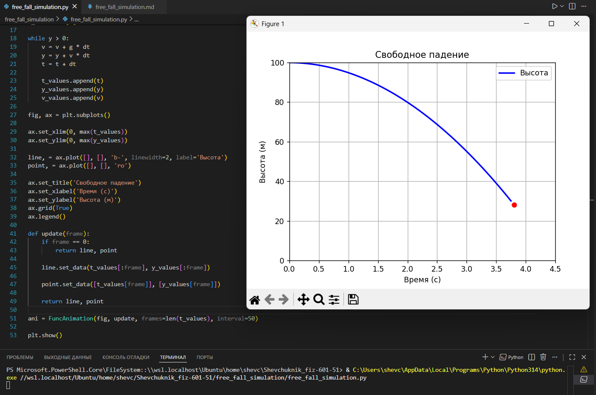

# Отчёт

## Задание_1

### Условие задачи

Создать программу, моделирующую свободное падение тела под действием силы тяжести.

Требования:

* использовать численный метод (метод Эйлера);
* вычислять положение и скорость тела во времени;
* визуализировать траекторию движения;
* реализовать динамическую анимацию процесса.

---

### Описание проделанной работы

1. **Математическая модель**

Рассматривается свободное падение тела без сопротивления воздуха.

Ускорение постоянно и равно:
$$
[
g = -9.81 ,\text{м/с}^2
]
$$
---

2. **Численное решение (метод Эйлера)**

Для расчёта движения используется метод Эйлера:

* скорость:
$$
  [
  v_{n+1} = v_n + g \cdot dt
  ]
$$

* координата:
$$
  [
  y_{n+1} = y_n + v_n \cdot dt
  ]
$$

Расчёт выполняется до момента достижения телом земли $$(( y \leq 0 )).$$

---

3. **Алгоритм программы**

4. Задаются начальные условия:

   * высота $$( y_0 = 100 ) м;$$
   * скорость $$( v_0 = 0 ) м/с.$$

5. В цикле:

   * вычисляется новая скорость;
   * вычисляется новая высота;
   * увеличивается время;
   * значения сохраняются в списки.

6. После расчёта:

   * строится график зависимости высоты от времени;
   * добавляется анимация движения точки.

---

4. **Визуализация**

* Используется библиотека `matplotlib`.
* Отображается:

  * линия — траектория падения;
  * точка — текущее положение тела.
* Анимация реализована с помощью `FuncAnimation`.

---

### Исходный код

```python
import numpy as np
import matplotlib.pyplot as plt
from matplotlib.animation import FuncAnimation

# параметры
g = -9.81
dt = 0.05
y0 = 100
v0 = 0

t = 0
y = y0
v = v0

t_values = [t]
y_values = [y]
v_values = [v]

# метод Эйлера
while y > 0:
    v = v + g * dt
    y = y + v * dt
    t = t + dt

    t_values.append(t)
    y_values.append(y)
    v_values.append(v)

# визуализация
fig, ax = plt.subplots()

ax.set_xlim(0, max(t_values))
ax.set_ylim(0, max(y_values))

line, = ax.plot([], [], 'b-', linewidth=2, label='Высота')
point, = ax.plot([], [], 'ro')

ax.set_title('Свободное падение')
ax.set_xlabel('Время (с)')
ax.set_ylabel('Высота (м)')
ax.grid(True)
ax.legend()

def update(frame):
    if frame == 0:
        return line, point

    line.set_data(t_values[:frame], y_values[:frame])
    point.set_data([t_values[frame]], [y_values[frame]])

    return line, point

ani = FuncAnimation(fig, update, frames=len(t_values), interval=50)

plt.show()
```

---

### Результаты выполнения программы

**Описание результата**:

* На экране отображается график зависимости высоты от времени.
* Линия показывает траекторию падения.
* Красная точка показывает текущее положение тела.
* График строится постепенно, создавая анимацию движения.

---

---

### Пояснение результатов

* Тело начинает движение с высоты 100 м с нулевой скоростью.
* Под действием силы тяжести скорость увеличивается по модулю.
* Высота уменьшается до нуля (момент удара о землю).
* График имеет форму параболы, что соответствует законам кинематики.

---

### Вывод

В ходе работы была реализована модель свободного падения тела с использованием метода Эйлера.
Полученные результаты соответствуют теоретическим ожиданиям: ускорение постоянно, а траектория имеет параболический вид.
Анимация позволяет наглядно наблюдать процесс движения во времени.

---

### Список использованных источников

1. [https://docs.python.org/3/](https://docs.python.org/3/)
2. [https://matplotlib.org/stable/index.html](https://matplotlib.org/stable/index.html)
3. [https://numpy.org/doc/](https://numpy.org/doc/)
4. [https://en.wikipedia.org/wiki/Free_fall](https://en.wikipedia.org/wiki/Free_fall)
5. [https://en.wikipedia.org/wiki/Euler_method](https://en.wikipedia.org/wiki/Euler_method)